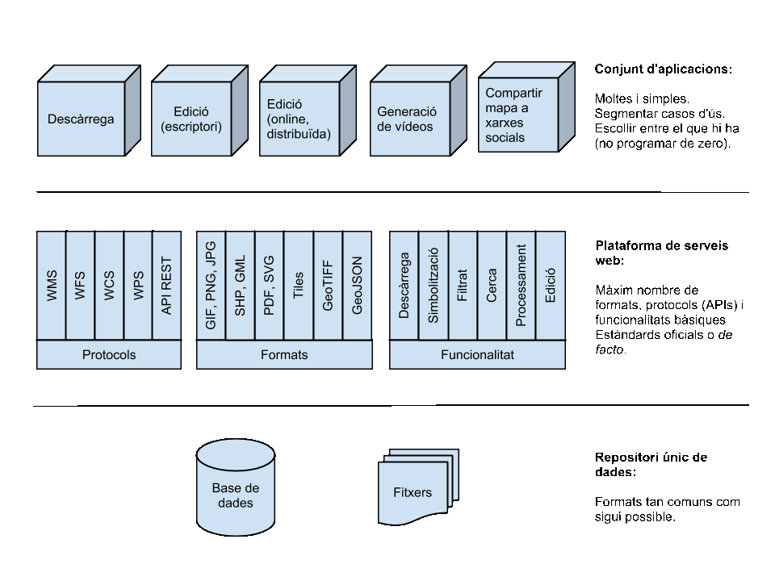

============
Arquitectura
============

Es proposa una arquitectura a tres nivells, amb un repositori de dades centralitzat i estable d'una banda, un conjunt d'aplicacions simples i adaptables de l'altra, i una àmplia plataforma de serveis web que maximitzi la seva interconnectivitat:

   Proposta d'arquitectura per maximitzar els usos de la informació tot prevenint la seva fragmentació.
